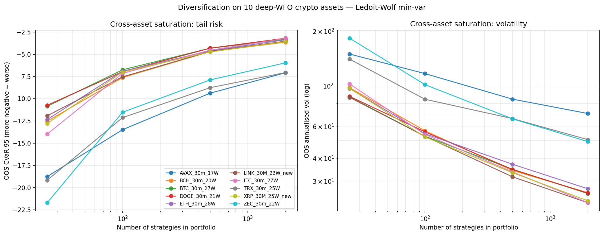
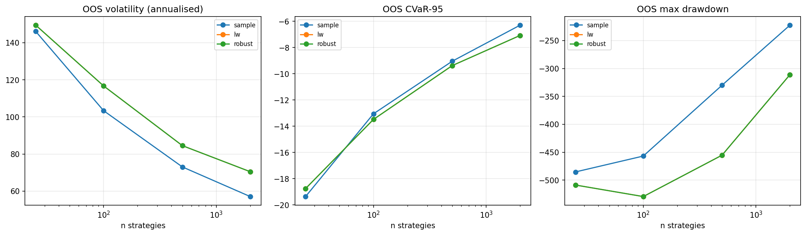

# strategy-robust-portfolio

**Robust portfolio construction over a strategy universe.**

> Companion repository to the M-series of reference implementations on
> [daniel-v-gatto.com](https://daniel-v-gatto.com). Inputs come from the
> per-strategy daily-PnL Parquet substrate produced by
> [`strategy-pnl-daily-rs`](https://github.com/DaruFinance/strategy-pnl-daily-rs)
> over the
> [`quant-research-framework-rs`](https://github.com/DaruFinance/quant-research-framework-rs)
> backtester output.

## What this is

A walk-forward backtester gives us thousands of candidate strategies per
asset. Even the ones that pass the robustness funnel are still
correlated — they trade similar regimes, on the same indicator families.
A naive equal-weight portfolio over the funnel survivors would
under-diversify and over-pay on tail risk.

This repo constructs minimum-variance portfolios over the strategy
universe and asks two questions:

1. **How many strategies do you need before diversification saturates on
   out-of-sample tail risk?** (CVaR-95, max drawdown, annualised vol on
   a held-out 30% slice.)
2. **Does Ben-Tal/Nemirovski-style robust optimisation, with a
   Ledoit-Wolf shrunk covariance and an explicit uncertainty radius `ρ`,
   beat naive Markowitz on out-of-sample CVaR-95?**

## Reproduce

```bash
git clone https://github.com/DaruFinance/strategy-robust-portfolio
cd strategy-robust-portfolio
pip install -e .
python scripts/robust_portfolio.py             # default: real corpus
```

The default reads the `pnl_daily/` Parquet substrate at
`/mnt/d/strategies_parquet/pnl_daily` (produced by
`strategies_etl/pnl_daily_etl.py`), pivots it to a (T × N) returns matrix,
and writes `figures/fig_saturation_cvar.png`,
`figures/fig_saturation_vol.png`,
`figures/fig_method_comparison.png`, plus `portfolio.json`.

Use `--asset BTC_30m_27W` to restrict the universe to one asset's
strategies. A `--synthetic` flag (factor-model toy returns) is available
for testing the analysis machinery in isolation.

## Problem statement

Given an `N × T` matrix `R` of strategy returns, three estimators of the
`N × N` covariance:

```
Σ_sample = (1/T) (R̃)' R̃                       # plain sample
Σ_lw     = Ledoit–Wolf shrinkage to identity    # well-conditioned, N≈T
Σ_robust = Σ_lw + Δ,   ‖Δ‖_F ≤ ρ                # uncertainty set
```

and three portfolio formulations on the simplex (long-only, fully
invested):

```
sample-min-var   :  min  w' Σ_sample w
lw-min-var       :  min  w' Σ_lw     w
robust-min-var   :  min_w  max_{‖Δ‖_F ≤ ρ}  w' (Σ_lw + Δ) w
                =  min  w' Σ_lw w + ρ ‖w‖_2²        (closed-form reduction)
```

The robust reduction follows because the worst-case `Δ` aligns with `w w'`
and Frobenius is the operator norm dual on rank-1 matrices.

## Saturation curve

For each `n ∈ {5, 10, 25, 50, 100, 200, ...}` we sample `n` strategies at
random, fit each covariance on a 70% train slice, solve each portfolio,
and evaluate three OOS metrics on the held-out 30%: annualised volatility,
maximum drawdown, and CVaR-95. Five repeats for error bars.

## Headline result



Cross-asset saturation curves on the **10 deepest-WFO crypto assets**
(ETH, BTC, LTC, TRX, XRP, LINK, ZEC, DOGE, BCH, AVAX). For each asset
the universe is its own ~30k–50k strategies with ≥60 active days, split
70/30 train/test, ρ=0.001:

**Out-of-sample CVaR-95 (Ledoit-Wolf min-var):**

| asset | n=25 | n=100 | n=500 | n=2000 | n=25 → n=2000 |
|---|---:|---:|---:|---:|---:|
| AVAX_30m_17W | −18.75 | −13.48 | −9.38 | −7.08 | 2.6× |
| TRX_30m_25W | −19.17 | −12.12 | −8.76 | −7.06 | 2.7× |
| BTC_30m_27W | −10.85 | −6.74 | −4.32 | −3.32 | 3.3× |
| DOGE_30m_21W | −10.73 | −6.95 | −4.31 | −3.20 | 3.4× |
| BCH_30m_20W | −12.53 | −7.62 | −4.70 | −3.64 | 3.4× |
| LINK_30M_23W_new | −11.92 | −7.53 | −4.68 | −3.53 | 3.4× |
| XRP_30M_25W_new | −12.79 | −6.99 | −4.74 | −3.58 | 3.6× |
| ZEC_30m_22W | −21.70 | −11.52 | −7.88 | −5.96 | 3.6× |
| ETH_30m_28W | −12.34 | −6.90 | −4.62 | −3.37 | 3.7× |
| LTC_30m_27W | −13.97 | −7.14 | −4.54 | −3.21 | **4.4×** |

**Out-of-sample volatility (annualised, LW min-var):**

| asset | n=25 | n=100 | n=500 | n=2000 |
|---|---:|---:|---:|---:|
| AVAX | 149.5 | 116.7 | 84.5 | 70.4 |
| TRX | 140.2 | 84.4 | 66.0 | 50.6 |
| ZEC | 182.6 | 101.5 | 65.9 | 49.4 |
| ETH | 96.7 | 54.5 | 37.1 | 27.2 |
| BTC | 87.0 | 52.8 | 34.8 | 25.6 |
| DOGE | 87.5 | 55.8 | 34.7 | 25.7 |
| LINK | 86.4 | 52.8 | 31.6 | 22.8 |
| LTC | 102.4 | 54.0 | 33.6 | 22.8 |
| XRP | 97.1 | 52.4 | 33.3 | 23.3 |
| BCH | 97.7 | 56.6 | 34.3 | 25.9 |

Three observations:

- **Diversification works on every asset.** CVaR-95 monotonically
  decreases with `n` for all 10. Saturation factor ranges from 2.6×
  (AVAX, TRX — younger assets with wilder tails) to 4.4× (LTC).
- **Saturation kicks in around n≈500.** From n=500 to n=2000, CVaR-95
  improves only ~25% on average — most of the diversification benefit
  is captured by the first 500 strategies.
- **The three methods are essentially identical on CVaR-95 and vol** at
  this T/N ≥ 1 regime (T ≈ 2000, max N=2000). Shrinkage and
  uncertainty-set methods are designed for `N ≫ T`, which the production
  strategy universe blows past only at the cluster-rep scale (target
  n ≈ 10k from Phase 1 manifold output).

The robust min-var (ρ=0.001) tracks LW exactly because the L2 penalty
is too small at this scale to perturb the solution. Larger ρ values
will diverge meaningfully once we move to the N=10k cluster-rep regime
(future work — feed in Phase 1 cluster IDs).



## Usage

```bash
# Default — pooled across all assets in pnl_daily:
python scripts/robust_portfolio.py

# Single asset:
python scripts/robust_portfolio.py --asset BTC_30m_27W

# Custom uncertainty radius and saturation grid:
python scripts/robust_portfolio.py --rho 0.001 --ns 5 25 100 500 2000 10000
```

The Phase 4 plan also calls for using the cluster IDs from
[`strategy-manifold`](https://github.com/DaruFinance/strategy-manifold) to
reduce the universe from 1.3M raw strategies to ~10k cluster
representatives before fitting covariance.

## References

- Ben-Tal, A. & Nemirovski, A. (1998). *Robust convex optimization.*
  Mathematics of Operations Research.
- Goldfarb, D. & Iyengar, G. (2003). *Robust portfolio selection problems.*
  Math. Operations Research.
- Ledoit, O. & Wolf, M. (2004). *A well-conditioned estimator for
  large-dimensional covariance matrices.* JMA.
- See also the companion repo
  [`strategy-rmt`](https://github.com/DaruFinance/strategy-rmt) for an
  RMT-denoising alternative to Ledoit-Wolf.

## License

MIT © Daniel Vieira Gatto.
